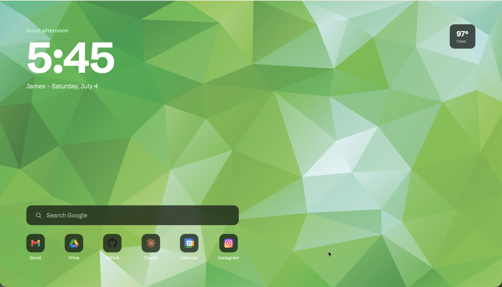

# Custom New Tab

A minimal browser new tab page with a clock, live weather updates (Open Meteo API), Google Search, and shortcuts.



## Quick start

Just open the [live page](https://jameshou28.github.io/custom-new-tab/). To make it your actual new tab, use a new-tab extension such as [New Tab Redirect](https://chromewebstore.google.com/detail/new-tab-redirect/icpgjfneehieebagbmdbhnlpiopdcmna) for Chrome) at the URL.

## Features

- Clock: 12-hour clock with a time-of-day greeting
- Weather: Current temperature and conditions from [Open-Meteo API](https://open-meteo.com/)
- Search bar: type anything and hit enter to search with Google
- Shortcuts: Shortcut tiles for Gmail, Drive, GitHub, Claude, Calendar, and Instagram

## Run it locally

Requires **Node.js 20+**.

```bash
git clone https://github.com/jameshou28/custom-new-tab.git
cd custom-new-tab
npm install
npm run dev
```

Create a `.env` for the weather fallback location (used when the browser cannot access your location):

```bash
VITE_LATITUDE= your latitude
VITE_LONGITUDE= your longitude
```

## How it works

The whole page is HTML/CSS/JS bundled by Vite.

Weather information comes from the OpenMeteo API. 

Deployment is a GitHub Actions workflow ([`.github/workflows/deploy.yml`](.github/workflows/deploy.yml)) that builds with Vite and publishes `dist/` to GitHub Pages on every push to `main`.

